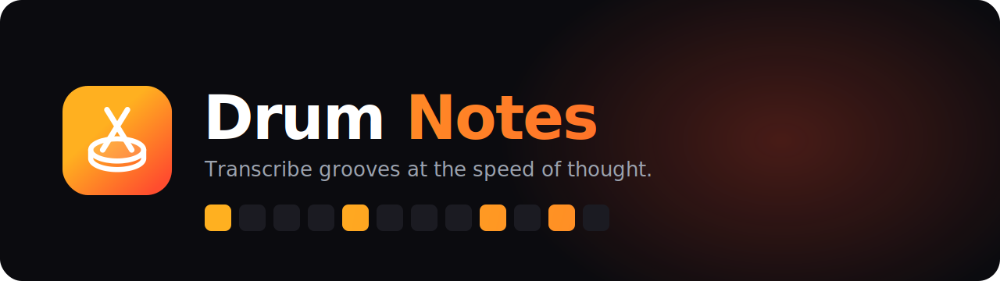

<div align="center">



<br/>

**A drum-notation editor focused on simplicity and speed.**
Create, edit, save and export drum scores — fully offline, no music-theory degree required.

<br/>

[](docs/product/roadmap.md)
[](LICENSE)
[](docs/architecture/storage.md)
[](https://www.typescriptlang.org/)
[](#-contributing)

[**Vision**](docs/product/vision.md) · [**Roadmap**](docs/product/roadmap.md) · [**Architecture**](docs/architecture/overview.md) · [**Docs**](#-documentation) · [**Brand**](docs/brand)

</div>

---

## ✦ Why Drum Notes?

Traditional notation software is built for orchestras, not for the drummer trying
to capture a groove before it slips away. **Drum Notes** strips it down to what
matters: a fast grid, eight kit voices, and a score that saves itself.

> 🥁 Hear a fill, grab it. No menus, no staff-paper ceremony, no internet.

<br/>

## ⚡ Features

- **🎛️ Grid editor** — toggle hits on a step grid across the 8 standard kit voices (hi-hat, ride, crash, snare, tom 1, tom 2, floor tom, kick).
- **🎼 Tempo & meter** — set BPM, time signature and subdivision; the grid adapts.
- **🧱 Measures** — add, duplicate and remove bars to build a song fast.
- **💾 Offline-first autosave** — every edit persists locally to IndexedDB. Close the tab, come back, it's there.
- **▶️ Playback & metronome** — hear the score and keep time, powered by Tone.js.
- **🎧 Reference audio + sync** — attach a track and map measures to timestamps to transcribe along.
- **📄 Export** — render clean **PDF** and **PNG** scores to print or share.

<br/>

## 🛠️ Built With


A pnpm + Turborepo monorepo. The domain is **framework-agnostic** so it can ride
to web, mobile and desktop unchanged.

<br/>

## 🚀 Getting Started

**Prerequisites:** Node **20+** (a `.nvmrc` pins `22.17.0`) and **pnpm** (via `corepack`).

```bash
nvm use            # picks up .nvmrc
corepack enable    # makes pnpm available at the pinned version
pnpm install
pnpm dev           # runs the web app with Turbopack
```

Then open **http://localhost:3000**.

### Scripts

| Command | What it does |
|---------|--------------|
| `pnpm dev` | Run the web app (`next dev --turbopack`). |
| `pnpm build` | Build all packages and the app via Turborepo. |
| `pnpm type-check` | Type-check every workspace. |
| `pnpm test` | Run Vitest across workspaces. |
| `pnpm lint` | Lint the whole repo (ESLint flat config). |
| `pnpm format` | Format with Prettier. |

<br/>

## 🗂️ Project Structure

```
drum-notes/
├─ apps/
│  └─ web/                 # Next.js app — UI + state orchestration
├─ packages/
│  ├─ core/                # shared types, utilities, constants (framework-agnostic)
│  ├─ notation-engine/     # the canonical domain: Score → Measure → Note
│  └─ ui/                  # shared components / design system
├─ docs/
│  ├─ product/             # vision · roadmap · glossary
│  ├─ architecture/        # overview · domain · frontend · storage
│  ├─ adr/                 # architecture decision records
│  ├─ specs/               # feature specifications
│  └─ brand/               # logo, banner & brand guide
└─ .claude/                # authoritative engineering rules
```

The **`notation-engine`** is the heart: one canonical `Score → Measure → Note`
model that the UI, persistence, playback and export all consume — never a
parallel representation. See [domain](docs/architecture/domain.md) and
[ADR-003](docs/adr/003-score-model.md).

<br/>

## 🗺️ Roadmap

- [x] Score editor — grid, instruments, measures, tempo & meter
- [x] Offline autosave (IndexedDB)
- [x] PDF / PNG export
- [x] Metronome & score playback (Tone.js)
- [x] Reference audio upload & measure sync
- [ ] Per-note durations & richer notation
- [ ] BPM detection from audio
- [ ] Mobile app
- [ ] Community score sharing

Full plan in [docs/product/roadmap.md](docs/product/roadmap.md).

<br/>

## 🎨 Brand

Drum Notes is warm, energetic and minimal. The signature gradient is the hero.


Logo, banner, full palette and voice live in [**docs/brand**](docs/brand).

<br/>

## 📚 Documentation

| Area | Links |
|------|-------|
| **Product** | [Vision](docs/product/vision.md) · [Roadmap](docs/product/roadmap.md) · [Glossary](docs/product/glossary.md) |
| **Architecture** | [Overview](docs/architecture/overview.md) · [Domain](docs/architecture/domain.md) · [Frontend](docs/architecture/frontend.md) · [Storage](docs/architecture/storage.md) |
| **Decisions** | [ADRs](docs/adr) |
| **Specs** | [docs/specs](docs/specs) |
| **Engineering rules** | [.claude](.claude) |

<br/>

## 🤝 Contributing

This is a personal project under active development — issues, ideas and PRs are
welcome. It follows **spec-driven development**: no code before a spec, and
architecture changes are recorded as an [ADR](docs/adr). Start with
[.claude/workflow.md](.claude/workflow.md).

<br/>

## 📄 License

[MIT](LICENSE) © Rafael Machado

<div align="center">
<br/>
<sub>Made with 🥁 and TypeScript.</sub>
</div>
